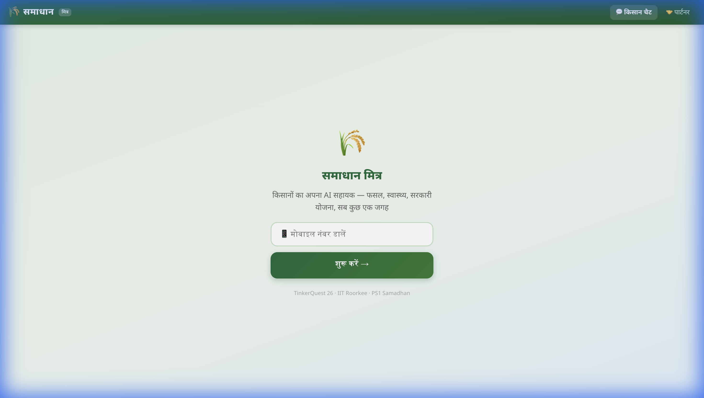
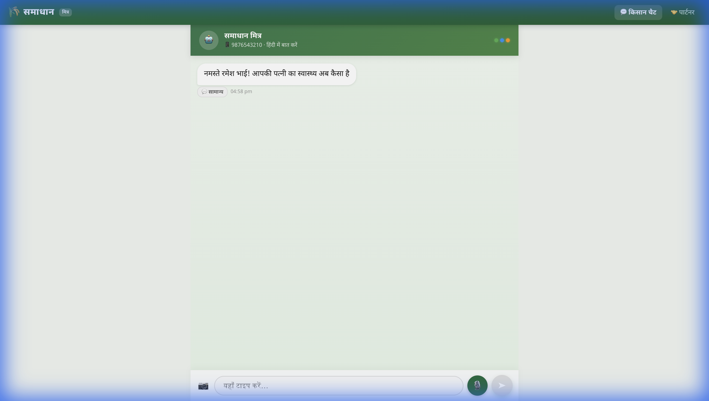
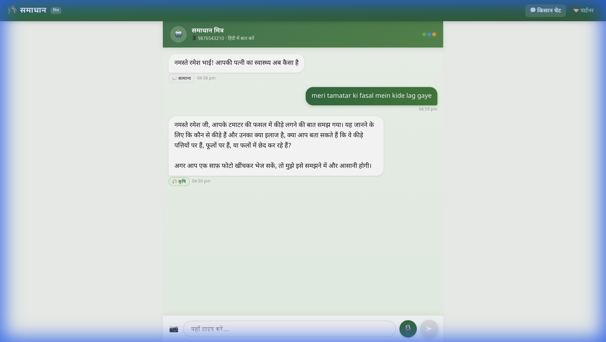
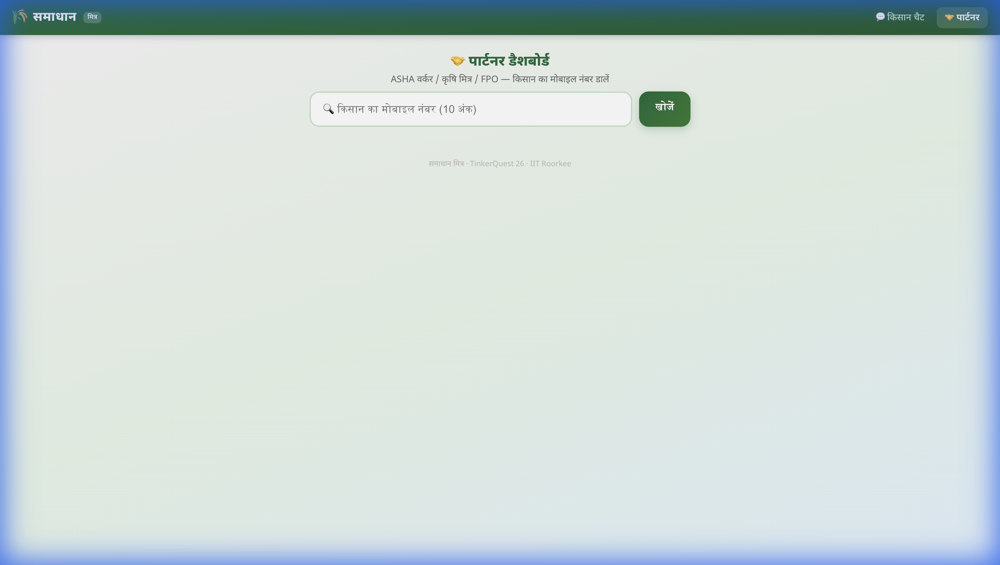
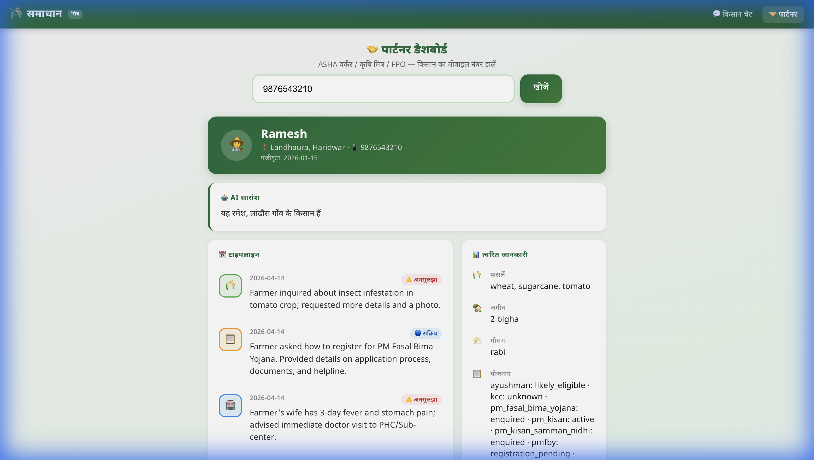
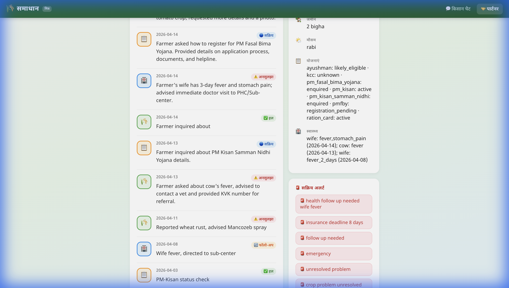

# समाधान मित्र (Samadhan Mitra) — Technical Report

> **TinkerQuest 26 · IIT Roorkee · PS1**
> An AI-powered conversational assistant for Indian farmers — covering agriculture, health triage, and government schemes.

---

## Table of Contents

1. [Product Overview](#1-product-overview)
2. [System Architecture](#2-system-architecture)
3. [Backend Deep-Dive](#3-backend-deep-dive)
   - 3.1 [API Endpoints](#31-api-endpoints)
   - 3.2 [Gemini Engine — Single-Call Architecture](#32-gemini-engine--single-call-architecture)
   - 3.3 [Four-Layer Memory System](#33-four-layer-memory-system)
   - 3.4 [Knowledge Base](#34-knowledge-base)
   - 3.5 [Speech-to-Text (Groq Whisper)](#35-speech-to-text-groq-whisper)
4. [Frontend Deep-Dive](#4-frontend-deep-dive)
   - 4.1 [Farmer Chat (User View)](#41-farmer-chat-user-view)
   - 4.2 [Partner Dashboard (ASHA/FPO View)](#42-partner-dashboard-ashafpo-view)
   - 4.3 [PWA & Offline Support](#43-pwa--offline-support)
5. [How Chat Responds — End-to-End Flow](#5-how-chat-responds--end-to-end-flow)
6. [How Memory Works — Cross-Session Continuity](#6-how-memory-works--cross-session-continuity)
7. [Domain Classification & Knowledge Tiers](#7-domain-classification--knowledge-tiers)
8. [Error Handling & Resilience](#8-error-handling--resilience)
9. [Test Results](#9-test-results)
10. [File Structure](#10-file-structure)
11. [Known Limitations](#11-known-limitations)
12. [Future Enhancements](#12-future-enhancements)

---

## 1. Product Overview

**Samadhan Mitra** is a Hindi-first, voice-enabled AI assistant designed for semi-literate farmers in rural India. It serves three core functions:

| Domain | What It Does |
|--------|-------------|
| 🌾 **Agriculture** | Crop disease diagnosis, treatment advice, prevention tips |
| 🏥 **Health** | Family health triage (never diagnoses — only triages and refers) |
| 📋 **Schemes** | Government scheme eligibility, registration guidance, helpline numbers |

**Key Differentiators:**
- **Memory**: Remembers past conversations across sessions — greets farmers by name, recalls their crops, follows up on unresolved problems
- **Voice-first**: Supports Hindi voice input via Groq Whisper Large V3
- **Image analysis**: Farmers can send crop photos for Gemini-powered visual diagnosis
- **Partner dashboard**: ASHA workers and Krishi Mitras can look up any farmer's full history, alerts, and AI-generated summary
- **Offline-capable**: PWA with cached fallback Q&A for areas with no connectivity

### Screenshots — Farmer View

**Welcome Page** — Phone number gate with premium branding:



**Proactive Greeting** — AI remembers Ramesh and asks about his wife's health (from a previous session):



**Chat Response** — Tomato pest query classified as कृषि (Agriculture) domain:



### Screenshots — Partner View

**Partner Dashboard Landing** — Search any farmer by phone number:



**Farmer Profile** — Full 360° view with AI summary, timeline, quick facts, and scheme status:



**Timeline & Alerts** — Historical interactions and active flags requiring attention:



---

## 2. System Architecture

```
┌────────────────────────────────────────────────────────────────┐
│                        FRONTEND (Vite + React)                 │
│  ┌──────────────┐  ┌──────────────┐  ┌─────────────────────┐  │
│  │  FarmerChat   │  │ PartnerView  │  │  VoiceInput /       │  │
│  │  (Welcome +   │  │ (Dashboard + │  │  MessageBubble      │  │
│  │   Chat UI)    │  │  Timeline)   │  │  (Shared Components)│  │
│  └──────┬───────┘  └──────┬───────┘  └──────┬──────────────┘  │
│         │                 │                  │                  │
│         └────────┬────────┴──────────────────┘                  │
│                  │  Vite Proxy (/api → :5001)                   │
└──────────────────┼──────────────────────────────────────────────┘
                   │ HTTP (JSON)
┌──────────────────┼──────────────────────────────────────────────┐
│                  │      BACKEND (Flask, Python 3.9+)            │
│  ┌───────────────▼─────────────────────────┐                    │
│  │         app.py (Flask Router)            │                    │
│  │  /chat  /greeting  /profile  /partner    │                    │
│  └───┬──────────┬──────────────┬────────────┘                    │
│      │          │              │                                  │
│  ┌───▼──────┐ ┌▼───────────┐ ┌▼─────────────────┐               │
│  │ Gemini   │ │ Profile    │ │ Groq Whisper      │               │
│  │ Engine   │ │ Manager    │ │ STT               │               │
│  │ (2.5     │ │ (4-Layer   │ │ (Hindi voice →    │               │
│  │  Flash)  │ │  Memory)   │ │  text)            │               │
│  └───┬──────┘ └─────┬──────┘ └──────────────────┘               │
│      │              │                                            │
│  ┌───▼──────┐ ┌─────▼──────┐                                    │
│  │Knowledge │ │ Profiles/  │                                    │
│  │ Base     │ │ <phone>.   │                                    │
│  │ (JSON)   │ │  json      │                                    │
│  └──────────┘ └────────────┘                                    │
└──────────────────────────────────────────────────────────────────┘
                   │
          ┌────────┴─────────┐
          │   External APIs  │
          │  ┌────────────┐  │
          │  │ Google     │  │
          │  │ Gemini 2.5 │  │
          │  │ Flash      │  │
          │  └────────────┘  │
          │  ┌────────────┐  │
          │  │ Groq       │  │
          │  │ Whisper    │  │
          │  │ Large V3   │  │
          │  └────────────┘  │
          └──────────────────┘
```

**Technology Stack:**

| Layer | Technology | Purpose |
|-------|-----------|---------|
| Frontend | React 18 + Vite 5 | SPA with hot reload |
| Styling | Vanilla CSS (inline) | Glassmorphism, gradients |
| Backend | Flask 3.x + Python 3.9 | REST API server |
| LLM | Google Gemini 2.5 Flash | Conversation + domain classification + profile extraction |
| STT | Groq Whisper Large V3 | Hindi voice → text (sub-second) |
| Storage | JSON files on disk | Farmer profiles (no database needed) |
| PWA | Service Worker + Manifest | Offline caching, installable |

---

## 3. Backend Deep-Dive

### 3.1 API Endpoints

The backend exposes 6 RESTful endpoints:

| Method | Endpoint | Purpose | Input | Output |
|--------|----------|---------|-------|--------|
| `GET` | `/health` | Health check | — | `{"status": "ok"}` |
| `POST` | `/chat` | Main conversation | `{phone, text, audio_b64?, image_b64?}` | `{response, domain, transcription?}` |
| `POST` | `/greeting` | Proactive greeting | `{phone}` | `{greeting}` |
| `GET` | `/profile/<phone>` | Farmer profile | — | Full profile JSON |
| `GET` | `/partner/<phone>/summary` | AI partner summary | — | `{summary}` |
| `GET` | `/offline` | Offline cache | — | `{cache: [...]}` |

**Request flow for `/chat`:**

```
1. Receive JSON: {phone, text, audio_b64, image_b64}
2. If audio_b64 → Groq Whisper STT → text
3. Load/create farmer profile
4. Check session timeout (30 min) → archive old session if needed
5. Add user message to active session
6. Single Gemini call → response + profile_update JSON
7. Parse <profile_update> tags from response
8. Add assistant message to session
9. Apply profile updates (crops, health, schemes, flags)
10. Save profile to disk
11. Return {response, domain}
```

### 3.2 Gemini Engine — Single-Call Architecture

**File:** `backend/agents/gemini_engine.py` (461 lines)

Unlike traditional multi-agent systems that route queries to specialized handlers, Samadhan uses a **single Gemini call** that handles everything simultaneously:

```
┌────────────────────────────────────────────────┐
│              SINGLE GEMINI CALL                │
│                                                │
│  INPUT:                                        │
│  ├── System prompt (identity + knowledge +     │
│  │   tier rules + profile extraction format)   │
│  ├── Farmer context (name, crops, past chats)  │
│  ├── Chat history (last 10 messages)           │
│  ├── User text query                           │
│  └── Optional: image (base64 → Part)           │
│                                                │
│  OUTPUT:                                       │
│  ├── Hindi conversation response               │
│  └── <profile_update> JSON block               │
│      ├── domain: agriculture|health|schemes    │
│      ├── entities_extracted: {crop, symptom,   │
│      │   scheme_name, family_member, ...}      │
│      ├── session_summary_update: "..."         │
│      └── flags: [unresolved_problem, ...]      │
└────────────────────────────────────────────────┘
```

**Why single-call?**
- **Latency**: One API call instead of 2-3 (no routing step + specialist step)
- **Context**: Gemini sees the full picture — profile + knowledge + history — in one context window
- **Multi-topic**: Can handle "meri gaay beemar hai aur PM Kisan ka status check karo" in one response

**System Prompt Structure (7 sections):**

1. **Identity & Personality** — Hindi Khariboli speaker, caring neighbor tone, never diagnoses
2. **Knowledge Tier Instructions** — Tier 1 (verified, use specifics), Tier 2 (general, add disclaimer), Tier 3 (out of scope, redirect)
3. **Verified Knowledge** — All 72 knowledge base entries injected here
4. **Profile Extraction** — Must output `<profile_update>` JSON after every response
5. **Conversation History** — Use chat history for pronoun resolution
6. **Multi-Topic Handling** — Address each domain in sequence
7. **Farmer Context** — Injected per-farmer: name, village, crops, past sessions, flags

**Profile Update Extraction:**

After every response, Gemini outputs a structured JSON block between `<profile_update>` tags. The backend parses this with regex:

```python
pattern = r'<profile_update>\s*(.*?)\s*</profile_update>'
match = re.search(pattern, response_text, re.DOTALL)
```

This extracted JSON is then used to:
- Classify the domain (agriculture / health / schemes / general)
- Extract entities (crop name, symptom, scheme name, etc.)
- Update the farmer's structured profile
- Add timeline entries
- Set alert flags

### 3.3 Four-Layer Memory System

**File:** `backend/utils/profile_manager.py` (329 lines)

Every farmer has a JSON profile stored at `backend/profiles/<phone>.json`. The memory operates in 4 layers:

```
┌──────────────────────────────────────────────┐
│  LAYER 4: PERCEIVED MEMORY                   │
│  "What the farmer feels we remember"         │
│  → Proactive greeting on each visit          │
│  → References past problems, upcoming        │
│    deadlines, unresolved issues               │
│  → Generated by generate_greeting()          │
├──────────────────────────────────────────────┤
│  LAYER 3: LIFE MEMORY (Structured Profile)   │
│  Permanent facts about the farmer:           │
│  ├── agriculture.primary_crops: [wheat, ...]  │
│  ├── agriculture.land_area: "2 bigha"         │
│  ├── agriculture.reported_problems: [...]     │
│  ├── health.family_queries: [{wife: fever}]   │
│  ├── schemes: {pm_kisan: {status: active}}    │
│  └── flags: [insurance_deadline, ...]         │
├──────────────────────────────────────────────┤
│  LAYER 2: SESSION MEMORY                     │
│  AI-generated one-line English summaries:    │
│  ├── "2026-04-13: Cow fever, referred to vet"│
│  ├── "2026-04-11: Wheat rust, Mancozeb spray"│
│  └── (max 10 recent sessions stored)          │
├──────────────────────────────────────────────┤
│  LAYER 1: CONVERSATIONAL MEMORY              │
│  Active session messages (current chat):     │
│  ├── {role: user, text: "...", timestamp}     │
│  ├── {role: assistant, text: "...", domain}   │
│  └── (max 20 messages, session_timeout: 30m)  │
└──────────────────────────────────────────────┘
```

**Session Management:**
- A session times out after **30 minutes** of inactivity
- When a session times out, Gemini generates a one-line English summary
- The session is archived into `recent_sessions` (max 10 kept)
- A new empty session is created

**Profile Schema:**

```json
{
  "phone": "9876543210",
  "name": "Ramesh",
  "village": "Landhaura",
  "district": "Haridwar",
  "registered_date": "2026-03-15",
  "active_session": {
    "session_id": "sess_20260414_1630",
    "session_start": "2026-04-14T11:00:00",
    "last_active": "2026-04-14T11:05:00",
    "messages": [
      {"role": "user", "text": "...", "timestamp": "..."},
      {"role": "assistant", "text": "...", "domain": "agriculture", "entities": {...}}
    ]
  },
  "recent_sessions": [
    {"session_id": "...", "date": "2026-04-13", "summary": "Cow fever, referred to vet", "domain": "health"}
  ],
  "profile": {
    "agriculture": {
      "primary_crops": ["wheat", "sugarcane", "tomato"],
      "land_area": "2 bigha",
      "current_season": "rabi",
      "reported_problems": [
        {"date": "...", "crop": "wheat", "problem": "rust", "status": "advised_treatment"}
      ]
    },
    "health": {
      "family_queries": [
        {"date": "...", "member": "wife", "symptom": "fever", "follow_up_needed": true}
      ]
    },
    "schemes": {
      "pm_kisan": {"status": "active"},
      "pmfby": {"status": "registration_pending"}
    }
  },
  "flags": ["crop_problem_unresolved_wheat_rust", "health_follow_up_needed_wife_fever", "insurance_deadline_8_days"],
  "timeline": [
    {"date": "2026-04-14", "domain": "agriculture", "summary": "Tomato insect problem", "status": "unresolved"}
  ]
}
```

**How context is injected into Gemini:**

The `get_context_for_prompt()` function builds a text block from the profile:

```
Farmer name: Ramesh
Village: Landhaura

Previous interactions with this farmer:
- 2026-04-13: Cow fever, referred to vet
- 2026-04-11: Wheat rust, Mancozeb spray advised

Crops: wheat, sugarcane, tomato
Land: 2 bigha
Schemes: pm_kisan: active, pmfby: registration_pending

Active flags: crop_problem_unresolved_wheat_rust, health_follow_up_needed_wife_fever
```

This is injected into **Section 7 (Farmer Context)** of the system prompt, giving Gemini full historical context for every conversation.

### 3.4 Knowledge Base

**Directory:** `backend/knowledge/` — 4 JSON files, **72 verified entries**

| File | Entries | Source | Content |
|------|---------|--------|---------|
| `crops.json` | 37 | ICAR/KVK verified | 10 crops × 3-4 problems each (wheat, rice, sugarcane, potato, tomato, peas, lentils, mustard, soybean, maize) |
| `schemes.json` | 10 | Government portals | PM-Kisan, PMFBY, Ayushman Bharat, Kisan Credit Card, PM-KUSUM, Soil Health Card, eNAM, PM Krishi Sinchai, ATMA, Organic Farming (Paramparagat) |
| `health.json` | 10 | Safe triage scenarios | Fever, diarrhea, snake bite, animal bite, pregnancy warning signs, child malnutrition, eye infection, skin rash, chest pain, pesticide poisoning |
| `referrals.json` | 15 | Roorkee-Haridwar region | KVK Roorkee, CHC Laksar, PHC Bhagwanpur, District Hospital Roorkee, Soil Testing Lab, IFFCO Center, etc. |

**Knowledge Tier System:**

```
┌─────────────────────────────────────────────────────────┐
│ TIER 1 — VERIFIED (in knowledge base)                   │
│ → Use specific chemical names, dosages, scheme criteria │
│ → "Mancozeb 75 WP 2.5 g/L spray karein"               │
├─────────────────────────────────────────────────────────┤
│ TIER 2 — GENERAL (topic recognized, not in KB)         │
│ → General guidance, NO specific chemicals/medicines    │
│ → "Yeh meri aam samajh hai, KVK se confirm karein"     │
├─────────────────────────────────────────────────────────┤
│ TIER 3 — OUT OF SCOPE (legal, financial, etc.)         │
│ → Warm redirect with contact info                      │
│ → "Block Development Officer se sampark karein"        │
└─────────────────────────────────────────────────────────┘
```

### 3.5 Speech-to-Text (Groq Whisper)

**File:** `backend/utils/groq_stt.py` (66 lines)

- Uses **Groq Whisper Large V3** for Hindi speech recognition
- Sub-second inference on Groq's hardware-accelerated infrastructure
- Accepts any audio format (WebM from browser MediaRecorder, WAV, MP3)
- Falls back gracefully if `GROQ_API_KEY` is not configured

**Flow:**
```
Browser MediaRecorder → WebM audio → base64 → Backend → Groq API → Hindi text → Chat pipeline
```

---

## 4. Frontend Deep-Dive

### 4.1 Farmer Chat (User View)

**File:** `frontend/src/pages/FarmerChat.jsx` (565 lines)

The farmer interface has two screens:

**Screen 1 — Welcome Gate:**
- Phone number input (10-digit validation)
- "शुरू करें →" button
- Premium branding with wheat icon logo

**Screen 2 — Chat Interface:**
- **Header**: "समाधान मित्र" with phone number and domain status dots (🟢 agriculture, 🔵 health, 🟠 schemes)
- **Proactive Greeting**: First message is auto-generated by `/greeting` endpoint — references past context
- **Message Bubbles**: User messages in green (right), AI in white (left)
- **Domain Tags**: Each AI response has a colored badge (कृषि / स्वास्थ्य / योजना)
- **Input Bar**: Text input + camera button (📷) + voice button (🎤) + send button (➤)
- **Image Preview**: Shows uploaded image before sending
- **Loading State**: Animated "समाधान सोच रहा है..." bubble

**Multimodal Input:**

| Input | How It Works |
|-------|-------------|
| **Text** | User types in Hindi/Hinglish → sent as `text` to `/chat` |
| **Voice** | 🎤 button → MediaRecorder → WebM → base64 → sent as `audio_b64` → Groq STT → text |
| **Image** | 📷 button → file picker → image resized → base64 → sent as `image_b64` with text |
| **Text + Image** | User types description + attaches photo → both sent together |

**Offline Fallback:**
When the backend is unreachable, the frontend searches a local cache of 5 pre-built Q&A pairs using keyword matching. It also fetches `/offline` endpoint on load for additional cached responses.

### 4.2 Partner Dashboard (ASHA/FPO View)

**File:** `frontend/src/pages/PartnerView.jsx` (371 lines)

**Target Users:** ASHA workers, Krishi Mitras, FPO officers, block-level agricultural officers

**Components:**

1. **Search Bar** — Enter farmer's phone number, click "खोजें"
2. **Profile Header Card** (green gradient) — Name, village, district, phone, registration date, farmer emoji
3. **AI सारांश (Summary) Card** — One-paragraph Hindi summary generated by Gemini, tailored for field workers
4. **📅 टाइमलाइन (Timeline)** — Chronological list of all interactions:
   - Each entry shows: date, domain icon (🌾/🏥/📋), summary, status badge (✅ हल / ⚠️ अनसुलझा / 🔄 फॉलो-अप / 🔵 सक्रिय)
5. **📊 त्वरित जानकारी (Quick Facts)** sidebar:
   - Crops grown
   - Land size
   - Current season
   - Scheme enrollment status
   - Health queries (family member + symptom + date)
6. **🚨 सक्रिय अलर्ट (Active Alerts)** — Red-bordered flag cards:
   - `health_follow_up_needed_wife_fever`
   - `insurance_deadline_8_days`
   - `crop_problem_unresolved_wheat_rust`

### 4.3 PWA & Offline Support

**Files:** `frontend/public/manifest.json`, `frontend/public/sw.js`, `frontend/src/main.jsx`

- **Service Worker**: Caches static assets (HTML, CSS, JS, fonts) using cache-first strategy
- **Manifest**: App name "समाधान मित्र", green theme, standalone display mode
- **Installable**: Can be added to Android home screen as a native-like app
- **Offline fallback**: If network is unavailable, Service Worker serves cached pages + local Q&A

---

## 5. How Chat Responds — End-to-End Flow

Here's the complete journey of a single farmer query:

```
FARMER: "mere gehun me peela rog lag gaya hai, kya karu?"
                        │
                        ▼
┌──────────────── STEP 1: FRONTEND ────────────────────┐
│ FarmerChat.jsx receives text                          │
│ → POST /api/chat {phone, text} via Vite proxy         │
└───────────────────────┬──────────────────────────────┘
                        │
                        ▼
┌──────────────── STEP 2: FLASK ROUTER ────────────────┐
│ app.py: chat_endpoint()                               │
│ ├── No audio → skip STT                              │
│ ├── get_or_create_profile("9876543210")               │
│ ├── check_session_timeout() → false (within 30 min)   │
│ └── add_message(profile, "user", text)                │
└───────────────────────┬──────────────────────────────┘
                        │
                        ▼
┌──────────────── STEP 3: GEMINI ENGINE ───────────────┐
│ gemini_engine.chat()                                  │
│ ├── Build farmer context from profile:                │
│ │   "Name: Ramesh, Crops: wheat, sugarcane            │
│ │    Past: wheat rust on 2026-04-11"                  │
│ ├── Build system prompt (7 sections + knowledge)      │
│ ├── Build chat history (last 10 messages)             │
│ ├── Full message: history + "Farmer: mere gehun..."   │
│ └── Gemini 2.5 Flash API call                         │
│                                                       │
│ GEMINI RESPONSE:                                      │
│   "रमेश जी, पिछली बार आपने बताया था कि पत्तियों पर   │
│    रतुआ (rust) था। Mancozeb 75 WP 2.5 g/L spray..."  │
│                                                       │
│   <profile_update>                                    │
│   {                                                   │
│     "domain": "agriculture",                          │
│     "entities_extracted": {                            │
│       "crop": "wheat",                                │
│       "problem": "yellow disease (peela rog)",        │
│       "symptom": "yellowing of leaves"                │
│     },                                                │
│     "session_summary_update": "Wheat yellow disease", │
│     "flags": ["unresolved_problem"]                   │
│   }                                                   │
│   </profile_update>                                   │
└───────────────────────┬──────────────────────────────┘
                        │
                        ▼
┌──────────────── STEP 4: PROFILE UPDATE ──────────────┐
│ profile_manager.apply_profile_update()                 │
│ ├── Add "wheat" to profile.agriculture.primary_crops  │
│ ├── Add problem entry to reported_problems            │
│ ├── Add "unresolved_problem" to flags                 │
│ ├── Add timeline entry: "Wheat yellow disease"        │
│ └── Save profile to profiles/9876543210.json          │
└───────────────────────┬──────────────────────────────┘
                        │
                        ▼
┌──────────────── STEP 5: RESPONSE ────────────────────┐
│ Return to frontend: {                                 │
│   "response": "रमेश जी, पिछली बार... Mancozeb...",    │
│   "domain": "agriculture"                             │
│ }                                                     │
│                                                       │
│ FarmerChat.jsx:                                       │
│ ├── Renders AI bubble with text                       │
│ ├── Shows "कृषि" domain badge in green               │
│ └── Optional: Text-to-Speech via window.speechSynthesis│
└──────────────────────────────────────────────────────┘
```

---

## 6. How Memory Works — Cross-Session Continuity

### Scenario: Ramesh returns after 2 days

**Day 1:** Ramesh asks about wheat rust → gets Mancozeb advice → session archived after 30 min inactivity

**Day 3:** Ramesh opens the app again

```
1. Frontend sends POST /greeting {phone: "9876543210"}

2. Backend loads profile → finds recent_sessions:
   - "2026-04-11: Wheat rust, Mancozeb spray advised"
   - Flags: ["crop_problem_unresolved_wheat_rust"]

3. get_context_for_prompt() builds:
   "Farmer: Ramesh, Village: Landhaura
    Previous interactions:
    - 2026-04-11: Wheat rust, Mancozeb spray
    Active flags: crop_problem_unresolved_wheat_rust"

4. Gemini generates greeting:
   "नमस्ते रमेश भाई! आपके गेहूँ पर रतुआ की समस्या
    कैसी है? क्या Mancozeb स्प्रे करने से फ़ायदा हुआ?"

5. Frontend shows this as the first message in chat
```

**This is Layer 4 (Perceived Memory)** — the farmer feels like the AI truly remembers them.

### How past context influences current responses

When Ramesh asks about wheat yellowing again:

```
System prompt includes:
  "Previous: 2026-04-11: Wheat rust, Mancozeb spray advised"

Chat history includes:
  Last 10 messages from current active session

Result: Gemini says "पिछली बार आपने बताया था कि पत्तियों पर
रतुआ (rust) के कारण पीलापन था। क्या इस बार भी ऐसे ही दाने
दिख रहे हैं?"
```

---

## 7. Domain Classification & Knowledge Tiers

**Domain Classification** happens inside the Gemini response — not as a separate routing step.

```
User message → Gemini (with system prompt containing all 3 domains' knowledge)
             ↓
             Gemini decides domain based on content:
             ├── "mere gehun mein..." → agriculture
             ├── "meri biwi ko bukhaar..." → health
             ├── "PM Kisan mein register..." → schemes
             └── "aur kya haal hai" → general
             ↓
             <profile_update> { "domain": "agriculture" }
```

**Health Safety Rails:**

The system prompt has strict rules:
- **NEVER** diagnose conditions
- **NEVER** prescribe medicines (except basic Paracetamol/ORS)
- **ALWAYS** provide one safe immediate action
- **ALWAYS** state when to seek professional help
- **ALWAYS** name the specific facility type (PHC, CHC, District Hospital)

Example health response:
> "आपकी पत्नी को 3 दिन से बुखार है — तुरंत डॉक्टर को दिखाना ज़रूरी है। PHC भगवानपुर या उप-स्वास्थ्य केंद्र लंढौरा ले जाएं। तब तक आराम करवाएं और ख़ूब पानी पिलाएं।"

---

## 8. Error Handling & Resilience

### Gemini API Retry Logic

```python
max_retries = 3
retry_delay = 1  # seconds

for attempt in range(max_retries):
    try:
        response = client.models.generate_content(...)
        return parse_response(response)
    except Exception as e:
        if ("503" in str(e) or "429" in str(e)) and attempt < max_retries - 1:
            time.sleep(retry_delay)
            retry_delay *= 2  # Exponential backoff: 1s → 2s → 4s
            continue
        return fallback_response()
```

### Other Error Handling

| Scenario | Response |
|----------|----------|
| Gemini 503 (overloaded) | Retry up to 3 times with exponential backoff |
| Gemini 429 (quota exceeded) | Retry with backoff, then Hindi error message |
| Groq STT failed | Return "आवाज़ प्रोसेस नहीं हो पाई" (422) |
| Audio unclear | Return "आवाज़ समझ नहीं आई — कृपया दोबारा बोलें" (422) |
| No text provided | Return "No query provided" (400) |
| Profile not found (partner) | Return 404 |
| Network offline (frontend) | Use local fallback Q&A cache |

---

## 9. Test Results

### API Endpoint Tests (8/8 Passed)

| # | Test | Input | Expected | Result |
|---|------|-------|----------|--------|
| 1 | Health | `GET /health` | Status OK | ✅ `{"status": "ok"}` |
| 2 | Profile | `GET /profile/9876543210` | Ramesh's data | ✅ Name=Ramesh, 7 timeline, 5 flags |
| 3 | Greeting | `POST /greeting` | Personalized Hindi | ✅ "नमस्ते रमेश जी" + wife health recall |
| 4a | Agriculture Chat | "gehun me peela rog" | Crop advice | ✅ Recalls past wheat rust, Mancozeb |
| 4b | Health Chat | "biwi ko 3 din se bukhaar" | Triage + refer | ✅ Domain: health, refers PHC Bhagwanpur |
| 4c | Schemes Chat | "fasal bima register" | Scheme details | ✅ Domain: schemes, PM Fasal Bima + CSC |
| 5 | Offline Cache | `GET /offline` | Cached Q&A | ✅ 5 Hindi Q&A pairs |
| 6 | Partner Summary | `/partner/.../summary` | Hindi narrative | ✅ AI-generated summary |
| 7 | Voice (empty) | Empty `audio_b64` | Reject | ✅ "No query provided" |
| 8 | Image Chat | Green test PNG | Analyze | ✅ "Only green color visible, send clearer photo" |

### Browser UI Tests (All Passed)

- ✅ Welcome page renders with premium branding
- ✅ Phone gate accepts 10-digit number
- ✅ Proactive greeting references past interactions
- ✅ Chat response displays with domain badge
- ✅ Partner search finds farmer profile
- ✅ Profile header shows name/village/district
- ✅ AI summary generates Hindi narrative
- ✅ Timeline shows domain-colored entries with status
- ✅ Quick facts display crops, land, schemes
- ✅ Alert flags display active concerns

---

## 10. File Structure

```
samadhan/
├── backend/
│   ├── app.py                          # Flask router (6 endpoints)
│   ├── .env                            # GEMINI_API_KEY, GROQ_API_KEY
│   ├── requirements.txt                # Python dependencies
│   ├── agents/
│   │   ├── gemini_engine.py            # Single-call Gemini architecture
│   │   ├── sunno.py                    # [Legacy] Query router (unused)
│   │   ├── khet.py                     # [Legacy] Agriculture agent (unused)
│   │   └── haq.py                      # [Legacy] Schemes agent (unused)
│   ├── utils/
│   │   ├── profile_manager.py          # 4-layer memory system
│   │   ├── groq_stt.py                 # Groq Whisper STT
│   │   └── bhashini.py                 # [Legacy] Translation (unused)
│   ├── knowledge/
│   │   ├── crops.json                  # 37 verified crop problems
│   │   ├── schemes.json                # 10 government schemes
│   │   ├── health.json                 # 10 health triage scenarios
│   │   └── referrals.json              # 15 Roorkee-Haridwar facilities
│   └── profiles/
│       ├── 9876543210.json             # Demo: Ramesh (pre-populated)
│       └── *.json                      # Auto-created per farmer
├── frontend/
│   ├── index.html                      # PWA meta tags, Noto Sans font
│   ├── vite.config.js                  # Proxy /api → localhost:5001
│   ├── package.json                    # React 18, Vite 5
│   ├── public/
│   │   ├── manifest.json               # PWA manifest
│   │   ├── sw.js                       # Service Worker
│   │   ├── icon-192.png                # PWA icon
│   │   └── icon-512.png                # PWA splash icon
│   └── src/
│       ├── main.jsx                    # React entry + SW registration
│       ├── App.jsx                     # Router + Navbar
│       ├── pages/
│       │   ├── FarmerChat.jsx          # Welcome + Chat UI
│       │   └── PartnerView.jsx         # Partner dashboard
│       └── components/
│           ├── MessageBubble.jsx       # Chat bubble + domain badge
│           └── VoiceInput.jsx          # MediaRecorder toggle
├── docs/
│   ├── Samadhan_Technical_Report.md    # This report
│   └── screenshots/                    # All verification screenshots
└── .env.example                        # Template for API keys
```

---

## 11. Known Limitations

| # | Limitation | Impact | Possible Fix |
|---|-----------|--------|-------------|
| 1 | **No database** — profiles stored as JSON files on disk | Not scalable beyond ~1000 farmers; no concurrent write safety | Migrate to SQLite or MongoDB |
| 2 | **No authentication** — phone number is the only identity | Anyone who knows a phone number can access the chat and profile | Add OTP verification via SMS gateway |
| 3 | **Gemini API dependency** — single point of failure | If Gemini is down, chat is completely unavailable (except offline cache) | Add a local fallback model or cache popular responses |
| 4 | **Session timeout is fixed at 30 min** — no configurability | May not suit all usage patterns | Make configurable per-farmer or per-region |
| 5 | **TTS uses browser SpeechSynthesis** — quality varies | Hindi voice quality depends on the device/browser | Upgrade to Google Cloud TTS WaveNet |
| 6 | **No image persistence** — images are processed but not stored | Cannot review past images in partner view | Store images as base64 or file references in profile |
| 7 | **Knowledge base is static** — requires manual updates | New crop diseases, scheme changes aren't auto-updated | Add admin panel or periodic scraping from ICAR/gov sites |
| 8 | **Referral map is Roorkee-Haridwar specific** — not generalizable | Only useful for Haridwar district farmers | Parameterize by location or use Google Maps API |
| 9 | **No multi-language support** — Hindi only | Excludes farmers in Tamil Nadu, Bengal, etc. | Add Bhashini translation layer |
| 10 | **No image verification** — farmers could send non-crop images | Gemini might waste tokens analyzing irrelevant images | Add a pre-filter using CLIP or image classification |
| 11 | **No rate limiting** — any user can send unlimited requests | Potential API cost overrun | Add per-phone rate limiting middleware |
| 12 | **No data backup** — profiles exist only on local disk | Risk of data loss | Add cloud backup or sync to S3/Firebase |
| 13 | **Profile updates are append-only** — no resolution tracking | Flags and timeline entries accumulate but problems don't get marked resolved automatically | Add follow-up detection to auto-resolve flags |
| 14 | **No analytics dashboard** — no visibility into usage patterns | Can't track which crops/schemes are most asked about | Add logging to a time-series DB + Grafana dashboard |

---

## 12. Future Enhancements

1. **OTP Authentication** — Integrate Twilio/MSG91 for phone number verification
2. **Google Cloud TTS** — Replace browser SpeechSynthesis with WaveNet for premium Hindi voice
3. **Regional Language Support** — Add Bhashini API integration for Tamil, Bengali, Marathi, etc.
4. **Admin Dashboard** — Knowledge base management UI for adding/editing crop data, schemes
5. **Deployment** — Vercel (frontend) + Render/Railway (backend) for production hosting
6. **Push Notifications** — Alert farmers about weather warnings, scheme deadlines, follow-up reminders
7. **WhatsApp Integration** — Connect via WhatsApp Business API for broader reach
8. **Crop Image Training** — Fine-tune a classifier on common Indian crop diseases for faster pre-diagnosis
9. **Analytics** — Track usage patterns, popular domains, response quality metrics

---

*Report generated: April 14, 2026 · समाधान मित्र v1.0 · TinkerQuest 26 · IIT Roorkee*
